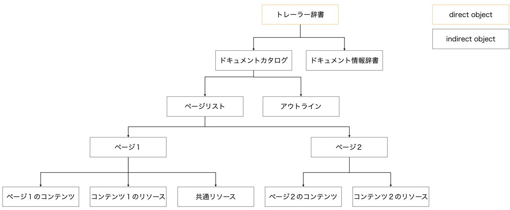

# lost pdf

## 問題
I'm pretty sure I created a two-page PDF file that shows a flag on one page, but the page is invisible. 
Where is the page?? I don't think it was deleted...

(*Please open with Google Chrome and Microsoft Edge when cannot open with Adobe.)

[lost.pdf](./chall/lost.pdf)

## 解答
問題のファイルを開くと "where is the another page?" と書かれたページのみが現れる．

PDFの構造はおおまかに以下で構成可能 ([参照](https://qiita.com/ysn/items/7a837b62a51f879462e4))

図のように，PDFはオブジェクトを基本要素とし，さらにオブジェクトに番号を振ることで他のオブジェクトから参照することが可能となる．
参照の仕方は
~~~
n m obj
オブジェクトの中身
endobj
~~~
で定義したオブジェクトを
~~~
n m R
~~~
とすることで可能となる． 
nにはオブジェクト番号，mには世代番号が振られる．（今回は世代番号が常に0なので気にしなくてよい）

**トレーラー**
~~~
trailer
<<
  /Root 1 0 R
  /Size 8
>>
startxref
2585
%%EOF
~~~
今回のPDFファイル構造は相互参照テーブル（参照を可能にするために各オブジェクトの開始バイト位置をまとめたテーブル）とトレーラーによるもので，ファイルを最後から読む． 
~~~
%%EOF
~~~
はエンドマーカー，

~~~
startxref
2585
~~~
は相互参照テーブルの開始バイト位置を表す．  
今回は2585バイト目からテーブル情報が開始．
~~~
/Root 1 0 R
/Size 8
~~~
はドキュメントカタログとしてobj 1を参照し，相互参照テーブルには8個のオブジェクトが記載されていることを示す．

**ドキュメントカタログ**
~~~
1 0 obj
<<
  /Type /Catalog
  /Pages 2 0 R
>>
endobj
~~~
~~~
/Type /Catalog
~~~
がドキュメントカタログを表し，
~~~
/Pages 2 0 R
~~~
がページツリー（ページリスト）としてobj 2を参照することを示している．

**ページツリー（ページリスト）**
~~~
2 0 obj
<<
  /Kids [4 0 R]
  /Type /Pages
  /Count 1
>>
~~~
PDFで表示する各ページのオブジェクト番号を指定する． 
/Kidsには表示するオブジェクトを指定し，/Countにはページ数を書く． 

実際にobj 4を見てみる．
~~~
4 0 obj
<<
  /Resources 5 0 R
  /Contents 7 0 R
  /Parent 2 0 R
  /Type /Page
  /MediaBox [0 0 800 500]
>>
endobj
7 0 obj
<<
  /Length 71
>>
stream
1. 0. 0. 1. 100. 250. cm
BT
/F0 36 Tf
(Here is the second page!) Tj
ET

endstream
endobj
~~~
/Resourcesでフォント等が定義されているobj 5を指定，/Contentsでページの内容が書かれたobj 7を指定，/Parentには木構造における親のobj 2が記載される． 
内容を示すobj 7に "where is the another page?" が見えることからobj 4を表示することで/Contentsで指定されたobj 7が間接的に表示されていることが分かる．  

これと同様の関係を探すと，
obj 3とobj 6がそれぞれobj 4, obj 7にあたる．
なので，表示するオブジェクトを指定するobj 2の/Kidsにobj 3を追加し，/Contentsを2にする．
~~~
2 0 obj
<<
  /Kids [3 0 R 4 0 R]
  /Type /Pages
  /Count 2
>>
~~~
これにより1ページ目が見えるようになる．
（/Kids [4 0 R 3 0 R]とした場合は2ページ目にフラグが出現する．）

> nag0m1{h1dd3n_p4g3_0f_pdf}
