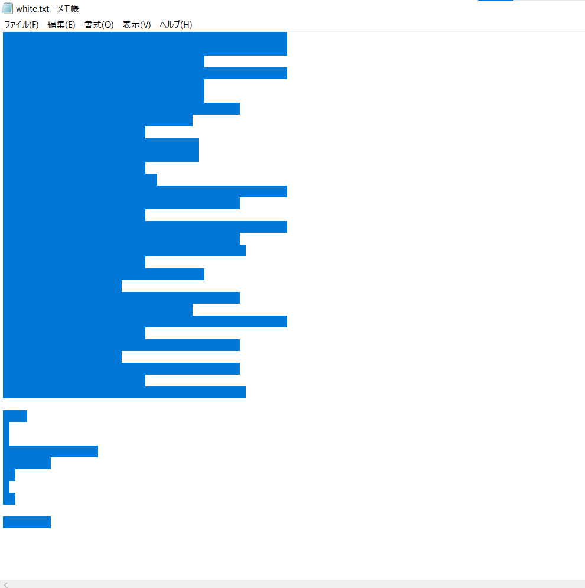

# whitespace

## 問題
Is it difficult to read this file?

note: flag format is nag0m1{flag}

[white.txt](./chall/white.txt)

## 解答
whitespace言語で書かれたプログラム 
一見すると何も書かれてないファイルだが，選択を行うとタブやスペースで何かが書かれていることが見える． 

スペースとタブ，改行のみで記述する難解プログラミング言語であり，そのままでは何をしているのかわからない． 
https://tio.run/#whitespace や https://ideone.com/ で実行

  
flag

  > nag0m1{3s0lang_1s_d1ff1cult_to_read}

