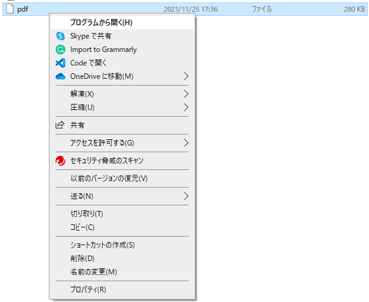
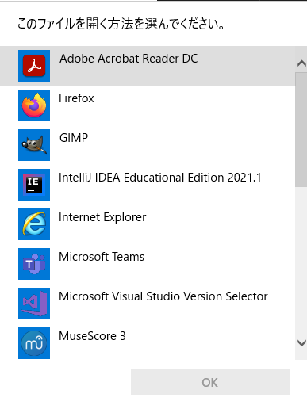
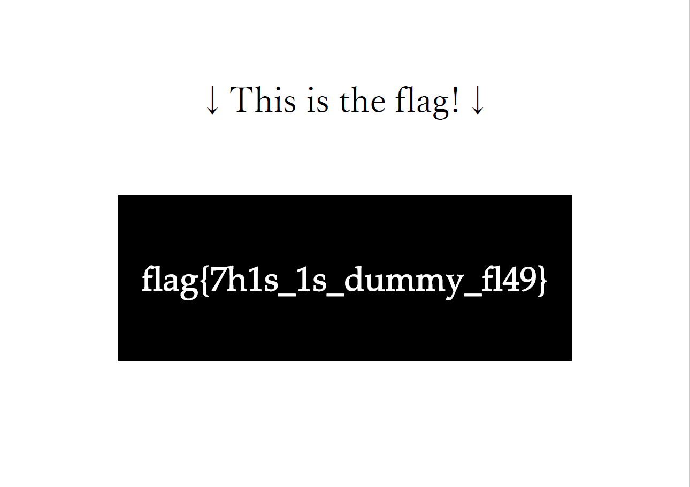

# nag0m1CTF

https://nag0mictf.tk

## general skill

### pdf

> Here is this problems' flag. Please enter the flag correctly.

pdfファイルをダウンロードしてみるが，拡張子がついていない．



そこで，ファイルを選択したのちに右クリック -> プログラムから開く -> PDFが閲覧できるアプリを選択



開くと無事にPDFが閲覧できるようになる．



この状態では`nag0m1{}`という形式の文字は見当たらない．しかし，`flag{...}`の上の部分をコピーしてメモ等に張り付けてみると，`nag0m1{}`形式の文字が表示される．

`nag0m1{h1dd3n_7ex7}`

---

*別解*

下記を入力することでファイル種類を取得することができる．

```
> file pdf
pdf: PDF document, version 1.7
```

PDFファイルとわかるので，ファイルの拡張子を`xxx.pdf`に変更することで，PDFファイルを開くことも可能．

```
> mv pdf pdf.pdf
```