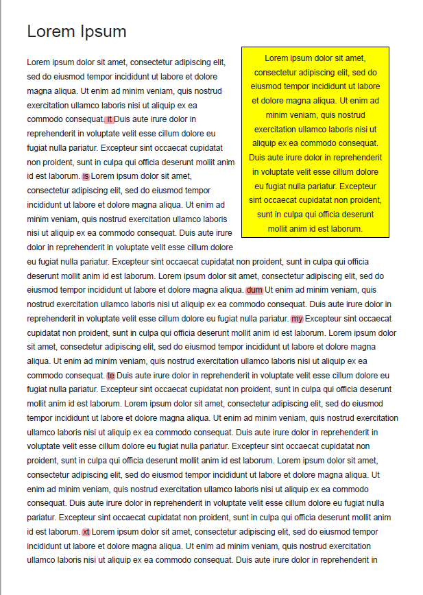

# Lorem ipsum
## 問題
For now, I finished only the prototype of the design.

note: flag format is nag0m1{flag}

[lorem.pdf](./chall/lorem.pdf)

## 解答
lorem ipsumにまぎれたflagを探し出す問題

[lorem ipsum](https://ja.wikipedia.org/wiki/Lorem_ipsum)とはレイアウトの調整等に用いるためのダミーテキストで，ある程度決まった文がある． 
本来のダミーテキストに無い箇所は以下の通り． 

これらをつなげてflagにする．

  
flag

  > nag0m1{itisdummytext}

