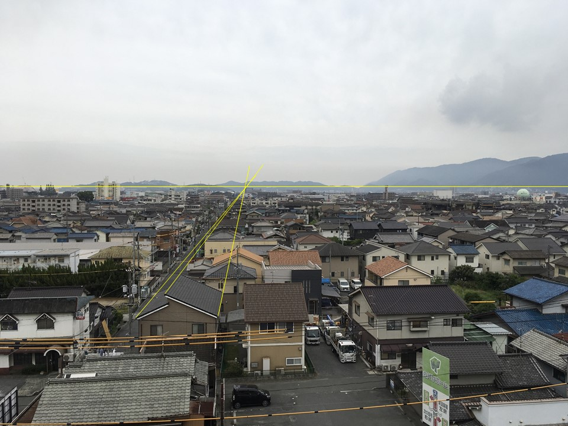
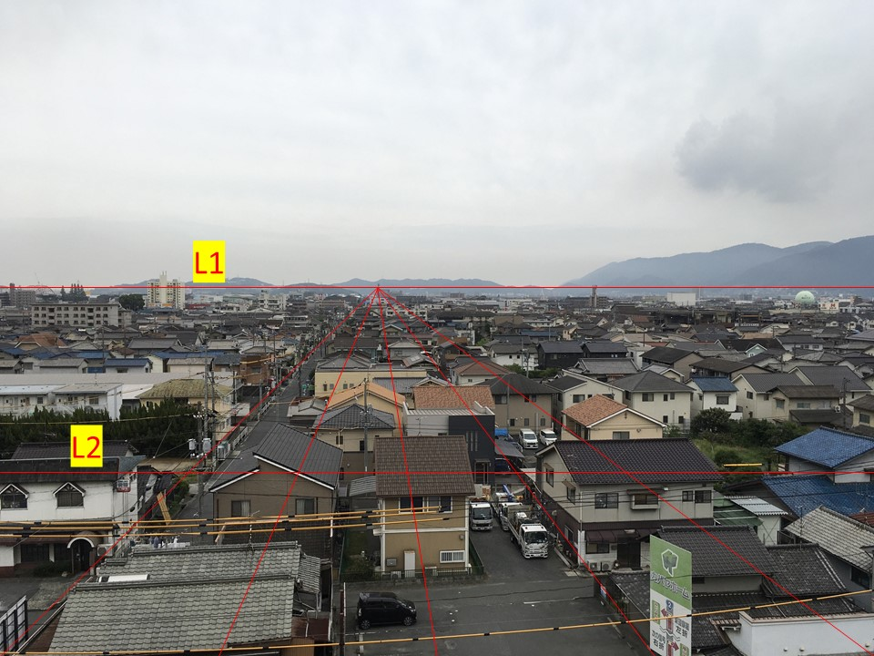
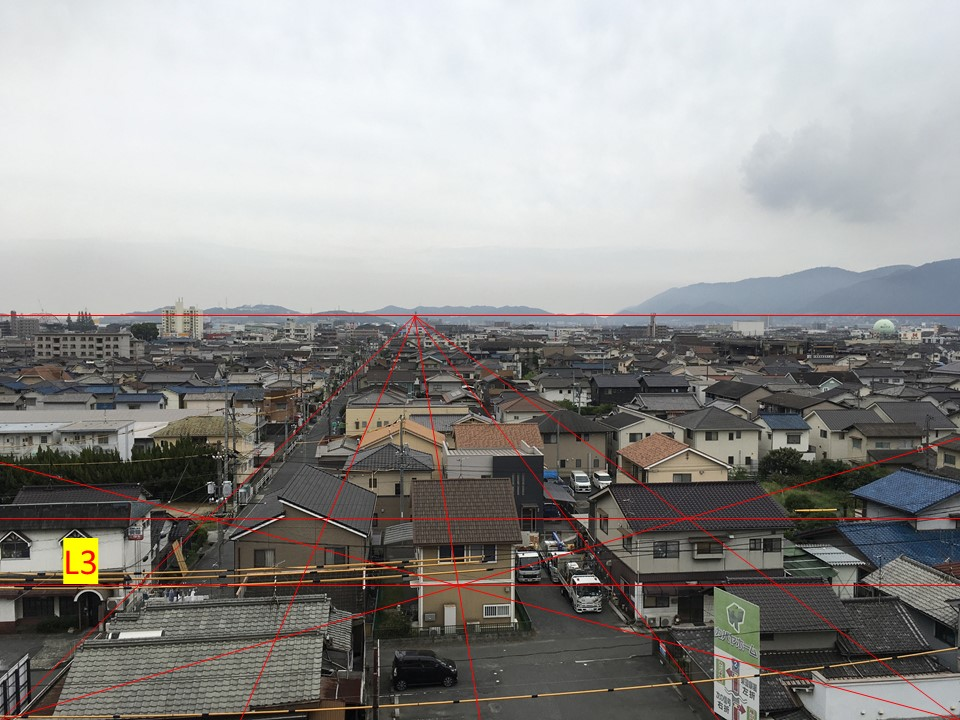
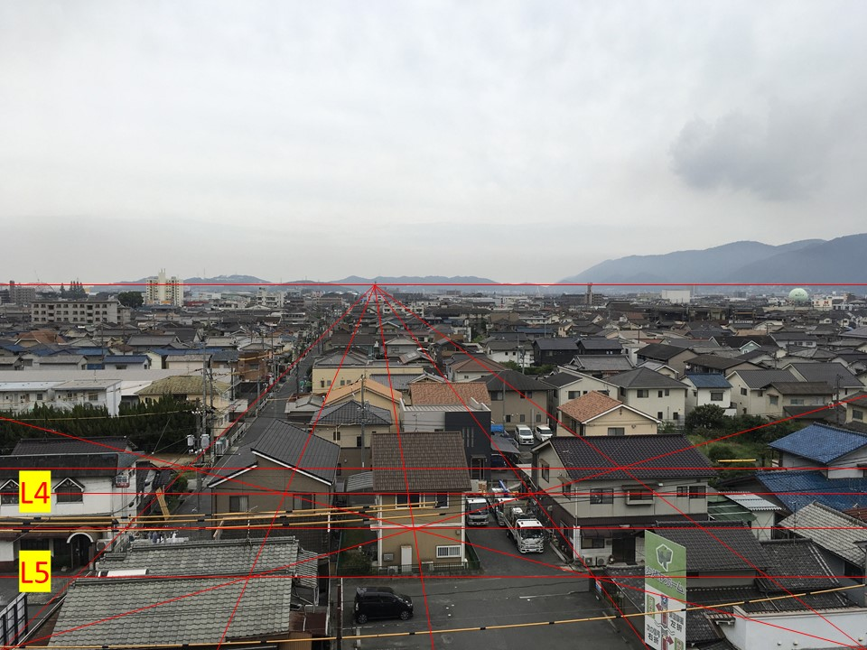
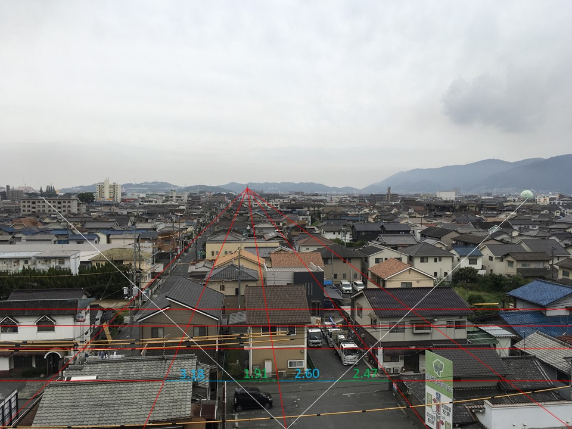
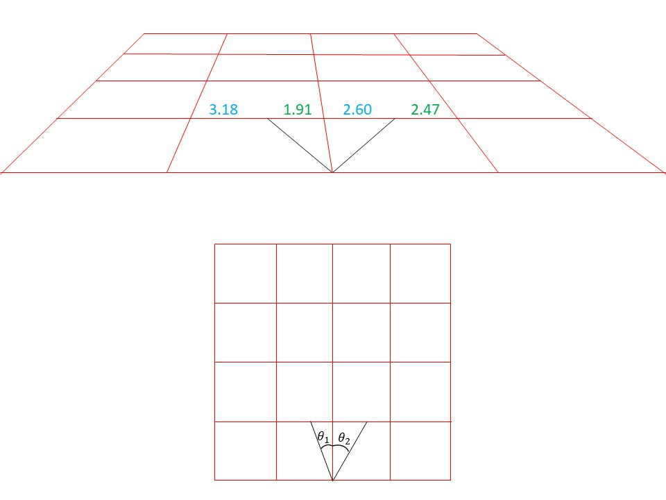

# secret meeting 3
## 問題
Gotcha!!!
We could arrest some of them, and succeeded in sent a spy. According to our spy, they didn't learn from the previous mistake and they are holding a meeting in the field. Our spy sent a picture taken from the conference place. Rush to the scene!!

Please round to the nearest fourth decimal place. 
note: flag format is nag0m1{latitude,longitude} 
e.g. (12.345,123.456) -> nag0m1{12.35,123.46}

[place.jpg](./chall/place.jpg)

## 解答
次の問題は画像検索では引っかからない問題です． 
画像から得られる情報をもとに人力で探しだします．

画像から得られる情報として文字を探すと「福山ガス」や「原内科」が見えます． 
検索すると福山市のある場所が出てくる． 
さらに，2つの建物の位置関係から，2つの建物よりも北側で写真を撮ったことが分かる．

[解法 1] 
画像手前に看板が立てられていることから東西に敷かれている大通りを順番に見る． 
さらに南北に道路が伸びていることから交差点付近に絞って見ていく．

すると，[このあたり](https://www.google.co.jp/maps/@34.4891692,133.3955998,3a,75y,233.4h,84.97t/data=!3m6!1e1!3m4!1sAw_r2AI5h1pCAw2gcWh0kw!2e0!7i16384!8i8192?hl=ja)で看板を見つけられる．
周りを見下ろしていることから高い場所での撮影が推測でき，位置としてはフタバ図書が有力となる．

[解法 2] 
一点透視図法を用いておおよその位置を推定した後，google mapにより特定を行う． 
「画像左真ん中の木または橋」と「福山ガス」，「ハローズ」と「原内科」から分かる角度を用いる．

例として「画像左真ん中の木」と「福山ガス」を用いた一点透視図法を挙げる． 
1.  まずは消失点を見つける． 
 
2.  消失点から，画像最下部の右下・左下・中心・右下と中心の間・左下と中心の間に向けて線を引く．
3.  消失点を通る平行線L1を引き，最下部と平行線L1の半分を通る平行線L2を引く． 
 
4.  画像の通りに対角線を引き，対角線の交点を通る平行線をL3とする． 
 
5.  L2とL3，L3と最下部の半分を通るL4，L5を引く 
 
6.  対象とする2点から中心に向けて線を引き，画像の箇所の長さを測る． 
 
7.  一点透視図法によって示したグリッド線と平面地図上での対応は下図のようになっており，計測した長さとarctanを用いて角度が分かる． 
 
8.  角度は 
 
 
となるので，2点からの角度は27.71°となる．

同様に「ハローズ」と「原内科」からの角度を計算すると大まかな位置が特定できる． 
参考までに[プログラム](./secret_meeting3.zip)を用いるとよい．(Windows コマンドプロンプトで実行するとうまくいく) 

赤点が例で取り上げた場所を示しており，赤点の1つをクリックしたのち，Set Placeボタンを押すと座標が保存される． 
4つの位置すべて同じ操作をしたのち，計算した角度を小数点以下第1位まで入力する． 
Executeボタンを押すと角度の関係を満たす地点を表示してくれるので，それをもとに位置を推定する．

  
flag

  > nag0m1{33.49,133.40}

